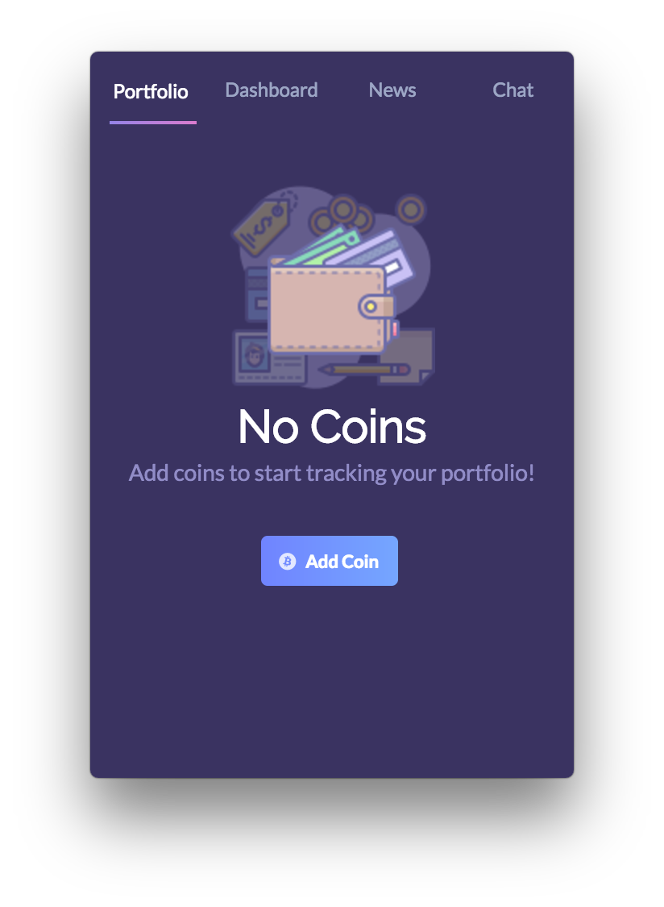

# coinstaq

A desktop application that tracks cryptocurrencies and other important information.




## Features
Currently, users can read the most up-to-date news on cryptocurrency articles. 

In the next release, users will be able to manage their own crypto portfolios.

## Development

### Install Dependencies

```bash
git clone git@github.com:kevinelberger/coinstaq.git
cd coinstaq && npm i
```

### Run

```bash
npm start
```

## Roadmap

* Add charts for cryptocurrency history stats
* Flesh out portfolio functionality (managing quantities of coins)